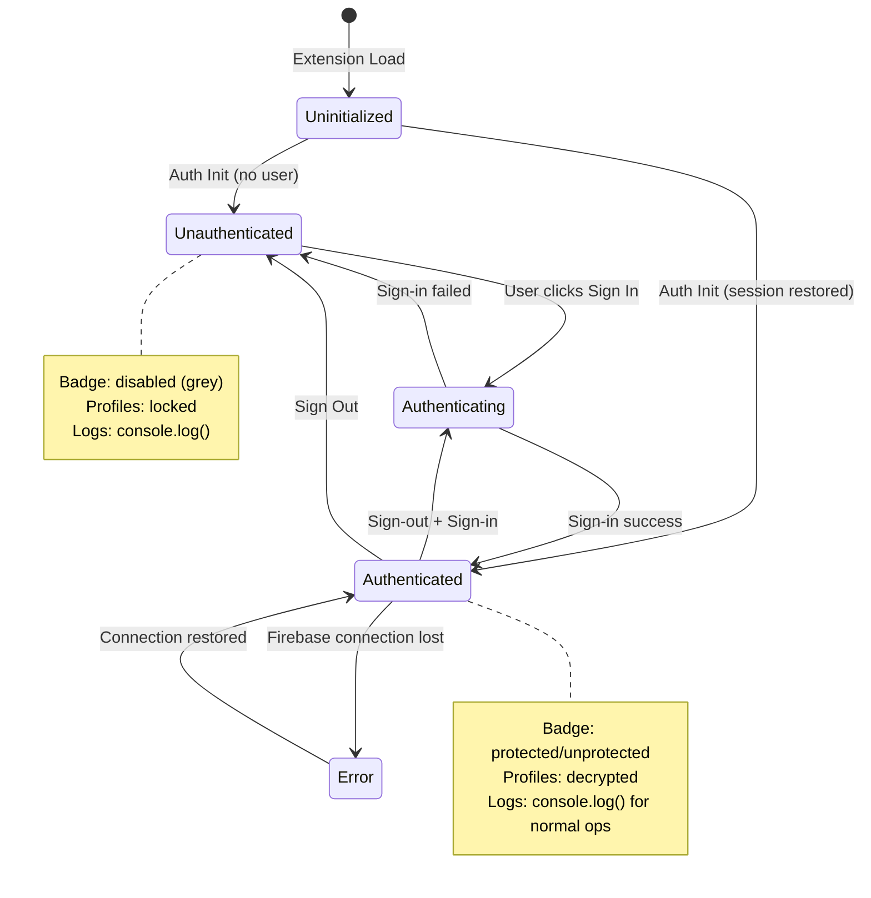

# Authentication State Comprehensive Overhaul Plan

**Date:** 2025-11-10
**Status:** ANALYSIS COMPLETE - READY FOR IMPLEMENTATION
**Severity:** CRITICAL - Extension shows "Error" when signed out
**Root Cause:** Expected auth errors logged as `console.error()`, Chrome treats as extension failure

---

## Executive Summary

The extension currently **fails to load** (shows "Error" in Chrome) when a user is signed out or signs out. The root cause is **architectural**: we designed the system assuming users would always be authenticated, and we log expected authentication errors (`ENCRYPTION_KEY_UNAVAILABLE`) as `console.error()`, which Chrome interprets as extension load failure.

This comprehensive analysis traces **every authentication state**, identifies **all failure points**, and proposes an **enterprise-grade solution** to handle auth states gracefully across the entire extension lifecycle.

---

## Table of Contents

1. [Current State Analysis](#1-current-state-analysis)
2. [Identified Issues](#2-identified-issues)
3. [Root Cause Analysis](#3-root-cause-analysis)
4. [Comprehensive Solution Design](#4-comprehensive-solution-design)
5. [Implementation Plan](#5-implementation-plan)
6. [Testing Strategy](#6-testing-strategy)
7. [Future-Proofing](#7-future-proofing)

---

## 1. Current State Analysis

### 1.1 System Architecture (Current)

**Three-Context Model:**
```
┌─────────────────────────────────────────────────────┐
│  SERVICE WORKER (background)                        │
│  - Firebase Auth: firebase/auth/web-extension       │
│  - Can decrypt profiles ONLY when authenticated     │
│  - Handles message routing, badge updates           │
│  - Runs continuously (30s idle timeout)             │
└─────────────────────────────────────────────────────┘
                    ↕ chrome.runtime.sendMessage
┌─────────────────────────────────────────────────────┐
│  CONTENT SCRIPT (isolated world in tab)             │
│  - Relays messages: page ↔ service worker           │
│  - Shows toasts/modals to user                      │
│  - Health checks every 5s                           │
└─────────────────────────────────────────────────────┘
                    ↕ window.postMessage
┌─────────────────────────────────────────────────────┐
│  PAGE SCRIPT (inject.js in main world)              │
│  - Intercepts fetch() calls to AI services          │
│  - Sends request bodies for PII substitution        │
└─────────────────────────────────────────────────────┘

┌─────────────────────────────────────────────────────┐
│  POPUP (extension UI)                               │
│  - Firebase Auth: firebase/auth (standard)          │
│  - User sign-in/sign-out interface                  │
│  - Profile management                               │
│  - Sends SET_PROFILES to service worker after auth  │
└─────────────────────────────────────────────────────┘
```

### 1.2 Authentication Flow (Current - FLAWED)

#### **Extension Load → Service Worker Init**
```typescript
// src/background/serviceWorker.ts:27-33
waitForAuth().then(() => {
  console.log('[Background] ✅ Firebase auth initialized in service worker');
}).catch(error => {
  console.error('[Background] ❌ Firebase auth initialization failed:', error);
});
```
**Flow:**
1. Extension loads → service worker starts
2. `waitForAuth()` initializes Firebase auth (web-extension module)
3. **If user signed out:** Auth initializes successfully (no error yet)
4. Service worker tries to load config/profiles → **FAILS**

#### **Auth State Change Listener**
```typescript
// src/background/serviceWorker.ts:85-120
auth.onAuthStateChanged(async (user) => {
  if (user) {
    // User signed in
    await storage.initialize();
    const profiles = await storage.loadProfiles();
    aliasEngine.setProfiles(profiles);
    // Update badges for all tabs
  } else {
    // User signed out
    console.log('[Background] 🔓 User signed out - profiles locked');
    aliasEngine.setProfiles([]);
    // ⚠️ NO BADGE UPDATES HERE - badges remain green!
  }
});
```
**Issues:**
- ✅ Clears profiles from alias engine when signed out
- ❌ **Does NOT update badges** when signed out (stays green!)
- ❌ No communication to content scripts that protection is lost

#### **Profile Loading (Signed Out)**
```typescript
// src/lib/storage/StorageProfileManager.ts:46-134
async loadProfiles(): Promise<AliasProfile[]> {
  try {
    const decrypted = await this.encryptionManager.decrypt(encryptedData);
    return JSON.parse(decrypted);
  } catch (error) {
    console.error('[StorageProfileManager] ❌ Profiles decryption failed:', error);
    console.error('[StorageProfileManager] Error message:', error.message);

    // Re-throw ENCRYPTION_KEY_UNAVAILABLE
    if (error.message.includes('ENCRYPTION_KEY_UNAVAILABLE')) {
      throw error; // ⚠️ This propagates up, eventually hits console.error()
    }
  }
}
```

#### **Encryption Key Access (Root of Error)**
```typescript
// src/lib/storage/StorageEncryptionManager.ts:102-175
private async getFirebaseKeyMaterial(): Promise<string> {
  const auth = await this.getAuthInstance();

  if (!auth.currentUser) {
    throw new Error(
      'ENCRYPTION_KEY_UNAVAILABLE: Please sign in to access encrypted data. ' +
      'Your profiles are encrypted with your Firebase UID for security.'
    );
  }

  return auth.currentUser.uid;
}
```
**When user is signed out:**
1. `auth.currentUser` = `null`
2. Throws `ENCRYPTION_KEY_UNAVAILABLE`
3. Error propagates through: `decrypt()` → `loadProfiles()` → caller
4. **PROBLEM:** Many callers log this as `console.error()`

#### **Badge Update Logic (Current)**
```typescript
// src/background/managers/BadgeManager.ts:99-186
async checkAndUpdateBadge(tabId: number, url?: string): Promise<void> {
  // 1. Check if AI service
  if (!this.isAIServiceURL(url)) {
    await chrome.action.setBadgeText({ tabId, text: '' });
    return;
  }

  // 2. Try to load config
  try {
    config = await this.storage.loadConfig();
  } catch (error) {
    // ✅ GOOD: Handles ENCRYPTION_KEY_UNAVAILABLE gracefully
    if (error.message.includes('ENCRYPTION_KEY_UNAVAILABLE')) {
      console.log(`[BadgeManager] Tab ${tabId}: Data locked (user not authenticated)`);
      await this.updateBadge(tabId, 'disabled');
      return;
    }
    throw error;
  }

  // 3. Check extension enabled
  if (!config?.settings?.enabled) {
    await this.updateBadge(tabId, 'disabled');
    return;
  }

  // 4. Check content script injected
  const isInjected = await this.contentScriptManager.isContentScriptInjected(tabId);

  // 5. Check profiles loaded and active
  try {
    const profiles = await this.storage.loadProfiles();
    hasActiveProfiles = profiles.some(p => p.enabled);
  } catch (error) {
    // ✅ GOOD: Handles ENCRYPTION_KEY_UNAVAILABLE gracefully
    if (error.message.includes('ENCRYPTION_KEY_UNAVAILABLE')) {
      console.log(`[BadgeManager] Tab ${tabId}: Profiles locked (user not authenticated)`);
    }
  }

  // 6. Set badge based on all conditions
  const isProtected = isInjected && hasActiveProfiles;
  await this.updateBadge(tabId, isProtected ? 'protected' : 'unprotected');
}
```
**Analysis:**
- ✅ Badge logic is **mostly correct** - handles signed-out state
- ✅ Uses `console.log()` for expected auth errors (not `console.error()`)
- ❌ Only runs on: tab activation, tab URL change, storage changes
- ❌ **Does NOT run** when user signs out via popup

#### **Health Check Handler (CRITICAL ISSUE)**
```typescript
// src/background/handlers/MessageRouter.ts:40-58
case 'HEALTH_CHECK': {
  const senderTabId = message.tabId || sender?.tab?.id;

  if (senderTabId) {
    // Update badge to protected (health checks are passing)
    const config = await this.storage.loadConfig();

    if (config?.settings?.enabled) {
      await this.badgeManager.updateBadge(senderTabId, 'protected');
      // ⚠️ BYPASSES checkAndUpdateBadge() - doesn't check profiles!
    }
  }

  return { success: true, status: 'ok' };
}
```
**CRITICAL BUG:**
- ❌ **Directly calls** `updateBadge('protected')` without checking profiles
- ❌ **Should call** `checkAndUpdateBadge()` to verify full protection stack
- ❌ This is likely why badges showed green before profiles loaded!

### 1.3 Content Script Health Checks

```typescript
// src/content/content.ts:364-435
window.addEventListener('message', async (event) => {
  if (event.data?.source === 'ai-pii-inject-health') {
    try {
      // Check if extension enabled
      const response = await chrome.runtime.sendMessage({ type: 'GET_CONFIG' });

      if (!response?.success || !response.data?.settings?.enabled) {
        window.postMessage({ isAlive: false }, '*');
        return;
      }

      // Check if domain protected
      const protectedDomains = response.data?.settings?.protectedDomains || [];
      const isDomainProtected = protectedDomains.some(...);

      if (!isDomainProtected) {
        window.postMessage({ isAlive: false }, '*');
        return;
      }

      // Verify background connection
      await chrome.runtime.sendMessage({ type: 'HEALTH_CHECK' });

      window.postMessage({ isAlive: true }, '*');
    } catch (error) {
      // Extension context invalidated
      window.postMessage({ isAlive: false }, '*');
    }
  }
});
```
**Analysis:**
- ✅ Checks extension enabled
- ✅ Checks domain protected
- ✅ Verifies background connection
- ❌ **Does NOT check** if profiles are loaded
- ❌ Can return `isAlive: true` even when no profiles exist!

### 1.4 Popup Sign-In Flow

```typescript
// src/popup/popup-v2.ts:150+
auth.onAuthStateChanged(async (user) => {
  if (user) {
    // User signed in - initialize store
    await store.initialize();
    // Store sends SET_PROFILES to service worker
  } else {
    // User signed out - show auth modal
    openAuthModal('signin');
  }
});
```
**Analysis:**
- ✅ Popup handles sign-in/sign-out correctly
- ✅ Sends profiles to service worker after sign-in
- ❌ **No message** sent to service worker when signing out
- ❌ Service worker only knows via `auth.onAuthStateChanged`

### 1.5 Sequence Diagrams

#### **Sequence 1: Extension Load (User Signed Out)**
```
Extension Load
    ↓
Service Worker Init
    ↓
Firebase Auth Init (web-extension)
    ↓ [auth.currentUser = null]
auth.onAuthStateChanged(null)
    ↓
[Background] 🔓 User signed out - profiles locked
    ↓
aliasEngine.setProfiles([])
    ↓
[NO BADGE UPDATES - tabs remain default state]
    ↓
Tab Loads AI Service (e.g., ChatGPT)
    ↓
Content Script Injected
    ↓
Health Check → Background
    ↓
GET_CONFIG → try loadConfig()
    ↓ [User not authenticated]
StorageEncryptionManager.getFirebaseKeyMaterial()
    ↓
throw ENCRYPTION_KEY_UNAVAILABLE
    ↓ [Caught in ConfigManager]
console.log('[StorageConfigManager] Config locked - user not authenticated')
    ↓
Health Check returns: { success: false, error: 'ENCRYPTION_KEY_UNAVAILABLE' }
    ↓
[Content Script] isAlive = false
    ↓
[Badge] Should show 'disabled' but logic depends on checkAndUpdateBadge()
```

**CURRENT BEHAVIOR:**
- If `checkAndUpdateBadge()` runs: Badge shows 'disabled' ✅
- If only health check runs: Badge might show green ❌ (HEALTH_CHECK handler bug)

#### **Sequence 2: User Signs In**
```
[Popup] User clicks "Sign in with Google"
    ↓
Firebase signInWithPopup()
    ↓ [Success]
auth.onAuthStateChanged(user)
    ↓ [IN POPUP]
store.initialize()
    ↓
storage.loadProfiles() [Uses Firebase UID to decrypt]
    ↓ [Success]
store.setProfiles(profiles)
    ↓
[Store sends message]
chrome.runtime.sendMessage({ type: 'SET_PROFILES', profiles })
    ↓ [IN SERVICE WORKER - ALSO receives auth change]
auth.onAuthStateChanged(user)
    ↓
storage.initialize()
    ↓
storage.loadProfiles() [Now works - user authenticated]
    ↓
aliasEngine.setProfiles(profiles)
    ↓
Update badges for all tabs
    ↓ [Calls checkAndUpdateBadge() for each tab]
Badge checks:
  - Extension enabled? ✅
  - Domain protected? ✅
  - Content script injected? ✅
  - Profiles loaded? ✅
    ↓
Badge shows 'protected' (green) ✅
```

**CURRENT BEHAVIOR:** Works correctly ✅

#### **Sequence 3: User Signs Out (THE PROBLEM)**
```
[Popup] User clicks "Sign Out"
    ↓
signOut(auth)
    ↓ [Success]
auth.onAuthStateChanged(null)
    ↓ [IN POPUP]
Popup shows auth modal ✅
    ↓ [IN SERVICE WORKER]
auth.onAuthStateChanged(null)
    ↓
[Background] 🔓 User signed out - profiles locked
    ↓
aliasEngine.setProfiles([])
    ↓
⚠️ NO BADGE UPDATES ❌
    ↓
[Tabs still show green badge]
    ↓
[NEXT: If any code tries to load profiles]
storage.loadProfiles()
    ↓
StorageEncryptionManager.getFirebaseKeyMaterial()
    ↓
throw ENCRYPTION_KEY_UNAVAILABLE
    ↓ [Propagates up]
Caller logs: console.error('[...] Failed to load profiles:', error)
    ↓
⚠️ CHROME SEES console.error()
    ↓
Extension shows "Error" in chrome://extensions ❌
```

**ROOT CAUSE IDENTIFIED:**
1. Sign-out does **not trigger badge updates**
2. Code that tries to load profiles **after sign-out** throws errors
3. These errors are logged as `console.error()` (not `console.log()`)
4. Chrome interprets `console.error()` as extension load failure

#### **Sequence 4: Tab Change (User Signed Out)**
```
User switches to AI service tab
    ↓
chrome.tabs.onActivated
    ↓
badgeManager.checkAndUpdateBadge(tabId, url)
    ↓
Try to load config
    ↓
storage.loadConfig()
    ↓
StorageEncryptionManager.decrypt()
    ↓
getFirebaseKeyMaterial()
    ↓
throw ENCRYPTION_KEY_UNAVAILABLE
    ↓ [Caught in checkAndUpdateBadge()]
console.log('[BadgeManager] Data locked (user not authenticated)') ✅
    ↓
updateBadge(tabId, 'disabled') ✅
```

**CURRENT BEHAVIOR:** Works correctly when triggered ✅

#### **Sequence 5: Health Check (User Signed Out)**
```
[Every 5s in inject.js]
Health Check
    ↓
window.postMessage({ source: 'ai-pii-inject-health' })
    ↓ [content.ts]
GET_CONFIG message to background
    ↓
Try to load config
    ↓
⚠️ ENCRYPTION_KEY_UNAVAILABLE thrown
    ↓
[MessageRouter or ConfigHandlers catches]
May log as console.error() or console.log() depending on context
    ↓
Returns { success: false, error: '...' }
    ↓
[content.ts]
Catches error → isAlive = false
    ↓
[inject.js]
Shows "Not Protected" modal to user
```

**CURRENT BEHAVIOR:**
- ✅ Health check fails correctly
- ⚠️ May log errors (depending on code path)
- ⚠️ Shows modal to user (could be annoying if signed out intentionally)

---

## 2. Identified Issues

### 2.1 Console Error Logging (CRITICAL)

**Location:** `src/lib/storage/StorageProfileManager.ts:64-66`
```typescript
console.error('[StorageProfileManager] ❌ Profiles decryption failed:', error);
console.error('[StorageProfileManager] Error type:', error.constructor.name);
console.error('[StorageProfileManager] Error message:', error.message);
```
**Issue:** Expected errors logged as `console.error()` → Chrome shows "Error"

**All locations using `console.error()` for `ENCRYPTION_KEY_UNAVAILABLE`:**
1. `src/lib/storage/StorageProfileManager.ts:64-66` ❌
2. `src/lib/storage/StorageProfileManager.ts:123-124` ❌
3. `src/lib/storage/StorageEncryptionManager.ts:242` (API key vault) ⚠️
4. `src/lib/storage/StorageEncryptionManager.ts:258` (API key vault) ⚠️
5. `src/lib/storage/StorageEncryptionManager.ts:273` (custom rules) ⚠️
6. `src/lib/storage/StorageEncryptionManager.ts:288` (custom rules) ⚠️
7. `src/lib/storage/StorageEncryptionManager.ts:303` (activity logs) ⚠️
8. `src/lib/storage/StorageEncryptionManager.ts:318` (activity logs) ⚠️
9. `src/lib/storage/StorageEncryptionManager.ts:333` (account data) ⚠️
10. `src/lib/storage/StorageEncryptionManager.ts:348` (account data) ⚠️
11. `src/lib/storage/StorageConfigManager.ts:148` (API key vault) ⚠️
12. `src/lib/storage/StorageConfigManager.ts:168` (custom rules) ⚠️
13. `src/lib/storage/StorageConfigManager.ts:188` (activity logs) ⚠️
14. `src/lib/storage/StorageConfigManager.ts:214` (account data) ⚠️

**Pattern:** ALL use `console.error()`, but MOST already have conditional logic:
```typescript
// GOOD PATTERN (already exists in many places):
if (!(error.message.includes('ENCRYPTION_KEY_UNAVAILABLE'))) {
  console.error('[...] Failed to decrypt:', error);
}
```

**Files with conditional logging (already correct):**
- ✅ `StorageEncryptionManager.ts:256-258` (API key vault)
- ✅ `StorageEncryptionManager.ts:286-288` (custom rules)
- ✅ `StorageEncryptionManager.ts:316-318` (activity logs)
- ✅ `StorageEncryptionManager.ts:346-348` (account data)

**Files needing fixes:**
- ❌ `StorageProfileManager.ts:64-66` (decryption failure)
- ❌ `StorageProfileManager.ts:123-124` (both methods failed)

### 2.2 Badge Not Updated on Sign-Out (CRITICAL)

**Location:** `src/background/serviceWorker.ts:115-119`
```typescript
} else {
  console.log('[Background] 🔓 User signed out - profiles locked');
  aliasEngine.setProfiles([]);
  // ⚠️ MISSING: Update badges for all tabs
}
```

**Fix Needed:**
```typescript
} else {
  console.log('[Background] 🔓 User signed out - profiles locked');
  aliasEngine.setProfiles([]);

  // Update badges for all tabs (protection lost)
  const tabs = await chrome.tabs.query({});
  for (const tab of tabs) {
    if (tab.id) {
      await badgeManager.checkAndUpdateBadge(tab.id, tab.url);
    }
  }
  console.log('[Background] ✅ Badges updated for all tabs (signed out)');
}
```

### 2.3 Health Check Bypasses Profile Verification (CRITICAL)

**Location:** `src/background/handlers/MessageRouter.ts:40-58`
```typescript
case 'HEALTH_CHECK': {
  // ...
  if (config?.settings?.enabled) {
    await this.badgeManager.updateBadge(senderTabId, 'protected');
    // ⚠️ Should call checkAndUpdateBadge() instead!
  }
  return { success: true, status: 'ok' };
}
```

**Fix Needed:**
```typescript
case 'HEALTH_CHECK': {
  const senderTabId = message.tabId || sender?.tab?.id;

  if (senderTabId) {
    console.log(`[MessageRouter] Health check passed for tab ${senderTabId}`);

    // Use checkAndUpdateBadge() to verify full protection stack
    await this.badgeManager.checkAndUpdateBadge(senderTabId, sender?.tab?.url);
  }

  return { success: true, status: 'ok' };
}
```

### 2.4 Health Check Doesn't Verify Profiles

**Location:** `src/content/content.ts:364-435`

**Current:** Health check returns `isAlive: true` even without profiles

**Issue:** User might see "protected" indicator but have no actual protection

**Fix Needed:** Health check should verify profiles exist and are loaded

### 2.5 Race Conditions

#### Race 1: Extension Load vs Auth Initialization
```
Extension loads → Service worker starts → waitForAuth() [async]
    ↓                                           ↓
Badge check runs                     Auth still initializing
    ↓
Tries to load config
    ↓
⚠️ Auth not ready → ENCRYPTION_KEY_UNAVAILABLE
```

**Impact:** Badge might flicker or show wrong state during load

**Mitigation Needed:** Wait for auth before first badge check

#### Race 2: Popup Sign-In vs Service Worker Auth State
```
[Popup] User signs in → auth.onAuthStateChanged(user)
    ↓                              ↓
store.initialize()         [Service Worker] auth.onAuthStateChanged(user)
    ↓                              ↓
Send SET_PROFILES              Load profiles
```

**Impact:** Service worker might load profiles twice (redundant but harmless)

**Current State:** This is acceptable - redundant but safe

#### Race 3: Tab Opens Before Auth Completes
```
Extension loads → Tab opens AI service → Content script injects
    ↓                     ↓
Auth still initializing   Health check runs
    ↓
Badge might show wrong state briefly
```

**Impact:** Badge might flicker during initial load

**Mitigation Needed:** Delay content script injection until auth ready

### 2.6 Assumptions of Authenticated State

**Locations where code assumes user is authenticated:**

1. **Popup initialization** (`src/popup/popup-v2.ts`)
   - Assumes `store.initialize()` will succeed
   - ✅ Actually handles sign-out correctly (shows auth modal)

2. **Background startup** (`src/background/serviceWorker.ts:38-41`)
   - Immediately creates `AliasEngine` instance
   - ✅ AliasEngine handles empty profiles correctly

3. **Message handlers** (various)
   - Some might not expect `ENCRYPTION_KEY_UNAVAILABLE`
   - ⚠️ Need to audit all message handlers

---

## 3. Root Cause Analysis

### 3.1 Why Did We "Forget" Sign-Out State?

#### Original Design Assumptions
Looking at the architecture docs and code, the system was designed with these assumptions:

1. **"Sign-in first" flow**: User signs in during onboarding, rarely signs out
2. **Firebase always available**: Persistent auth session maintained
3. **Popup-centric**: User interacts via popup (which handles auth)
4. **Service worker as processor**: Service worker just processes requests

**Evidence from docs:**
- `docs/development/ARCHITECTURE.md` focuses on PII protection flow
- Auth state transitions not explicitly documented
- Sign-out flow not mentioned in any sequence diagrams
- `docs/BADGE_ISSUE_POSTMORTEM.md` confirms we fixed toast but not badge

#### Where Sign-Out Was Considered

✅ **Popup:** Correctly shows auth modal when signed out
✅ **Badge logic:** `checkAndUpdateBadge()` handles `ENCRYPTION_KEY_UNAVAILABLE`
✅ **Content script:** Health checks fail gracefully when signed out

#### Where Sign-Out Was NOT Considered

❌ **Auth state listener:** Doesn't update badges when user signs out
❌ **Health check handler:** Bypasses profile verification
❌ **Error logging:** Logs expected auth errors as `console.error()`
❌ **Content script:** Shows "Not Protected" modal even when user signed out intentionally

### 3.2 Design Decisions That Led to This

#### Decision 1: Firebase UID Encryption
**Made:** Early in development
**Reason:** Strong security - key separation (data in storage, key in Firebase)
**Consequence:** **Cannot decrypt without auth** - signed-out state becomes "data locked"

**Trade-off:**
- ✅ Security: Best practice key separation
- ❌ Usability: Requires persistent auth session
- ❌ Complexity: Must handle auth state transitions

#### Decision 2: Service Worker with Web-Extension Auth
**Made:** When migrating to Manifest V3
**Reason:** Service workers can't use standard Firebase auth (no DOM)
**Consequence:** Two auth contexts (popup + service worker) that must stay in sync

**Trade-off:**
- ✅ Architecture: Proper Manifest V3 support
- ❌ Complexity: Two `auth.onAuthStateChanged` listeners
- ❌ Race conditions: Auth state might differ between contexts temporarily

#### Decision 3: Badge as Protection Indicator
**Made:** Core feature from v1
**Reason:** User needs real-time protection status
**Consequence:** Badge must **accurately reflect** all three conditions: enabled + authenticated + profiles loaded

**Trade-off:**
- ✅ UX: Clear visual indicator
- ❌ Complexity: Badge depends on multiple async state checks
- ❌ Performance: Must run badge checks frequently (tab changes, health checks)

#### Decision 4: Health Checks Every 5s
**Made:** To detect extension reload / context invalidation
**Reason:** User needs warning if protection breaks
**Consequence:** Frequent badge updates, potential performance impact

**Trade-off:**
- ✅ Reliability: Detects broken protection quickly
- ❌ Performance: 5s interval creates many badge checks
- ❌ UX: Could show "Not Protected" modal when user intentionally signed out

### 3.3 Assumptions in Codebase

#### Assumption 1: "User is always signed in"
**Evidence:**
- `console.error()` used for `ENCRYPTION_KEY_UNAVAILABLE` in StorageProfileManager
- No badge updates when user signs out
- Health check handler assumes profiles are available if extension enabled

**Impact:** Extension shows "Error" when signed out

#### Assumption 2: "Popup will initialize first"
**Evidence:**
- Original CONTEXT_AUTH_ENCRYPTION_ANALYSIS.md said: "Popup must be opened at least once after each reload for profiles to be available"

**Impact:** This was actually fixed (service worker has its own auth), but assumption lingered in badge logic

#### Assumption 3: "Health check = protection active"
**Evidence:**
- HEALTH_CHECK handler directly sets badge to 'protected' without checking profiles

**Impact:** Green badge shown before profiles loaded

### 3.4 What Happens During Sign-In → Sign-Out Transition?

**Timeline of events:**

```
T=0s:   User clicks "Sign Out" in popup
T=0.1s: signOut(auth) completes
T=0.1s: [Popup] auth.onAuthStateChanged(null) fires
T=0.1s: [Popup] Shows auth modal to user
T=0.2s: [Service Worker] auth.onAuthStateChanged(null) fires
T=0.2s: [Service Worker] aliasEngine.setProfiles([])
T=0.2s: [Service Worker] Logs: "User signed out - profiles locked"
T=0.2s: ⚠️ NO BADGE UPDATES
T=1.0s: [Any code trying to load profiles]
T=1.0s: StorageProfileManager.loadProfiles()
T=1.0s: throw ENCRYPTION_KEY_UNAVAILABLE
T=1.0s: ⚠️ console.error() in StorageProfileManager
T=1.0s: ⚠️ Chrome extension shows "Error"
```

**State inconsistency period:** 0.2s - until next badge check
- Profiles cleared in alias engine ✅
- Badges still showing green ❌
- User thinks they're protected ❌

**Error surfacing:** Whenever code tries to decrypt data after sign-out

---

## 4. Comprehensive Solution Design

### 4.1 State Definition

**Authentication States:**
```typescript
type AuthState =
  | 'uninitialized'        // Extension just loaded, auth not ready
  | 'unauthenticated'      // User not signed in (never signed in OR signed out)
  | 'authenticating'       // Sign-in in progress
  | 'authenticated'        // User signed in, can decrypt data
  | 'error';               // Auth error (Firebase down, etc.)
```

**Profile States:**
```typescript
type ProfileState =
  | 'unloaded'             // Profiles not loaded yet
  | 'loading'              // Loading/decrypting in progress
  | 'loaded-empty'         // Loaded successfully, but 0 profiles exist
  | 'loaded-active'        // Loaded successfully, ≥1 enabled profile
  | 'locked';              // Cannot load (unauthenticated)
```

**Protection States (Badge):**
```typescript
type ProtectionState =
  | 'protected'            // Full protection active
  | 'unprotected'          // Protection broken (no profiles, script failed, etc.)
  | 'disabled'             // Extension disabled OR domain not protected
  | 'initializing';        // Extension loading, state unknown
```

### 4.2 State Determination Logic

**Protection State Calculation:**
```typescript
function calculateProtectionState(
  authState: AuthState,
  profileState: ProfileState,
  extensionEnabled: boolean,
  domainProtected: boolean,
  contentScriptInjected: boolean
): ProtectionState {

  // Extension disabled or domain not protected
  if (!extensionEnabled || !domainProtected) {
    return 'disabled';
  }

  // Auth not ready yet
  if (authState === 'uninitialized' || authState === 'authenticating') {
    return 'initializing';
  }

  // User not authenticated
  if (authState === 'unauthenticated') {
    return 'disabled'; // Can't protect without auth
  }

  // Auth error
  if (authState === 'error') {
    return 'unprotected';
  }

  // Profiles not loaded yet
  if (profileState === 'loading' || profileState === 'unloaded') {
    return 'initializing';
  }

  // Profiles locked (shouldn't happen if authenticated, but defensive)
  if (profileState === 'locked') {
    return 'disabled';
  }

  // No profiles exist or none enabled
  if (profileState === 'loaded-empty') {
    return 'unprotected';
  }

  // Content script not injected
  if (!contentScriptInjected) {
    return 'unprotected';
  }

  // All conditions met
  return 'protected';
}
```

### 4.3 State Machine for Each Lifecycle State

#### **State 1: Fresh Install (Never Signed In)**

**Initial Conditions:**
- Auth: `unauthenticated`
- Profiles: `locked`
- Extension: `enabled` (default after install)

**Badge Behavior:**
- AI service tabs: Show `disabled` (grey, no badge text)
- Non-AI tabs: No badge

**Profile Data:**
- Encrypted data: Does not exist yet
- chrome.storage.local: Empty or default config

**Logging:**
- No errors logged (expected state)
- Info logs: "Extension installed, awaiting sign-in"

**UI:**
- Popup: Shows auth modal ("Sign in to get started")
- Content script: No protection toast
- Health checks: Return `isAlive: false` (domain enabled but no auth)

**What Happens Next:**
- User opens popup → sees auth modal
- User signs in → transitions to **State 4: Signed In**

#### **State 2: Signed Out (Was Signed In, Now Signed Out)**

**Initial Conditions:**
- Auth: `unauthenticated` (transition from `authenticated`)
- Profiles: `locked` (data exists but encrypted)
- Extension: `enabled`

**Badge Behavior:**
- AI service tabs: Show `disabled` (grey, no badge text)
- Non-AI tabs: No badge
- **Transition:** Badges must update **immediately** when sign-out occurs

**Profile Data:**
- Encrypted data: Exists in chrome.storage.local
- Cannot be decrypted (no Firebase UID)

**Logging:**
- Info logs: "User signed out, profiles locked"
- **No errors** (expected state)

**UI:**
- Popup: Shows auth modal ("Sign in to unlock your data")
- Content script: No protection toast
- Health checks: Return `isAlive: false`
- **No "Not Protected" modal** (user intentionally signed out)

**What Happens Next:**
- User opens popup → sees auth modal
- User signs in → transitions to **State 4: Signed In**

#### **State 3: Signing In (Transition)**

**Initial Conditions:**
- Auth: `authenticating` (transition from `unauthenticated`)
- Profiles: `loading`
- Extension: `enabled`

**Badge Behavior:**
- AI service tabs: Show `initializing` (grey with "..." text)
- Updates to `protected` or `unprotected` once loading completes

**Profile Data:**
- Decryption in progress (using Firebase UID)

**Logging:**
- Info logs: "User signed in, loading profiles..."
- Progress logs: "Decrypting profiles...", "✅ Profiles loaded: N profiles"

**UI:**
- Popup: Shows loading indicator
- Content script: Wait for profiles before showing toast
- Health checks: Return `isAlive: false` (not ready yet)

**What Happens Next:**
- Profiles load successfully → transitions to **State 4: Signed In**
- Profiles fail to load → transitions to **State 7: Error State**

#### **State 4: Signed In (Authenticated, Profiles Available)**

**Substates:**
- **4a: No profiles created yet**
  - Auth: `authenticated`
  - Profiles: `loaded-empty`
  - Badge: `unprotected` (red with "!" text)

- **4b: Profiles exist but all disabled**
  - Auth: `authenticated`
  - Profiles: `loaded-empty`
  - Badge: `unprotected` (red with "!" text)

- **4c: Active profiles, content script injected**
  - Auth: `authenticated`
  - Profiles: `loaded-active`
  - Content script: `injected`
  - Badge: `protected` (green with "✓" text)

**Badge Behavior:**
- Updates dynamically based on profile state and content script status

**Profile Data:**
- Fully accessible and decryptable
- Changes saved immediately (re-encrypted with Firebase UID)

**Logging:**
- Info logs for profile operations
- Activity tracking enabled

**UI:**
- Popup: Full functionality (profile management, stats, etc.)
- Content script: Protection toast shown (if profiles active)
- Health checks: Return `isAlive: true`

**What Happens Next:**
- User signs out → transitions to **State 2: Signed Out**
- User disables extension → transitions to **State 6: Disabled**
- Network issues → may transition to **State 8: Network Issues**

#### **State 5: Signing Out (Transition)**

**Initial Conditions:**
- Auth: `authenticated` → `unauthenticated` (transition)
- Profiles: `loaded-*` → `locked` (transition)
- Extension: `enabled`

**Badge Behavior:**
- **CRITICAL:** Badges must update **immediately**
- Transition: `protected` → `disabled` across all tabs

**Profile Data:**
- Alias engine cleared: `aliasEngine.setProfiles([])`
- Encrypted data remains in storage (locked)

**Logging:**
- Info logs: "User signing out..."
- Info logs: "Profiles locked, badges updated"
- **No errors**

**UI:**
- Popup: Transitions to auth modal
- Content script: Remove protection toast if showing
- Health checks: Switch to returning `isAlive: false`

**What Happens Next:**
- Immediately transitions to **State 2: Signed Out**

#### **State 6: Extension Disabled**

**Initial Conditions:**
- Extension: `disabled` (user toggled off in settings)
- Auth: Any state
- Profiles: Any state (irrelevant)

**Badge Behavior:**
- All tabs: No badge (extension inactive)

**Profile Data:**
- Not accessed (extension disabled)

**Logging:**
- Info logs: "Extension disabled by user"

**UI:**
- Popup: Shows "Extension Disabled" message with toggle
- Content script: Inactive (no interception)
- Health checks: Not running

**What Happens Next:**
- User enables extension → returns to previous auth state

#### **State 7: Error State (Auth/Firebase Failure)**

**Initial Conditions:**
- Auth: `error`
- Extension: `enabled`

**Badge Behavior:**
- AI service tabs: Show `unprotected` (red with "!" text)

**Profile Data:**
- Cannot access (Firebase unavailable)

**Logging:**
- **Error logs appropriate:** `console.error('[Firebase] Connection failed: ...')`
- This is a **real error** (not expected state)

**UI:**
- Popup: Shows error banner ("Cannot connect to Firebase. Check your internet connection.")
- Content script: Shows error message if user tries to send message
- Health checks: Return `isAlive: false`

**What Happens Next:**
- Firebase connection restored → return to authenticated state
- User retries sign-in → attempt to recover

#### **State 8: Network Issues / Firebase Unavailable**

**Initial Conditions:**
- Auth: `authenticated` (session exists locally)
- Firebase: Unreachable (network down)
- Profiles: `loaded-active` (cached from previous load)

**Badge Behavior:**
- Tabs: Continue showing `protected` (cached state)
- Health checks may start failing eventually

**Profile Data:**
- Uses cached profiles (already loaded before network loss)
- Cannot save changes (writes fail)

**Logging:**
- Warning logs: "Cannot sync with Firebase, using cached data"
- Error logs for save failures: `console.error('[Firebase] Failed to save: network error')`

**UI:**
- Popup: Shows warning banner ("Working offline - changes won't be saved")
- Content script: Protection continues with cached profiles
- Health checks: Still return `isAlive: true` if profiles cached

**What Happens Next:**
- Network restored → resume normal operation
- Network prolonged → eventually transition to error state

### 4.4 Error Logging Policy

**Principle:** `console.error()` is **ONLY** for unexpected errors that indicate bugs or failures.

**Policy:**

#### ✅ **Log as `console.error()`:**
- Firebase connection failures (network errors, auth server down)
- Decryption failures for **unexpected reasons** (corrupted data, wrong key)
- Code bugs (null pointer, type errors, etc.)
- Chrome API failures (extension context invalidated unexpectedly)

#### ✅ **Log as `console.warn()`:**
- Expected issues that might need attention:
  - User has no profiles created yet (authenticated but no data)
  - Content script injection failed (CSP issues, etc.)
  - Health check degradation (passing → failing over time)

#### ✅ **Log as `console.log()` or `console.info()`:**
- **Expected state transitions**:
  - User signed in
  - User signed out
  - Profiles locked (user not authenticated)
  - `ENCRYPTION_KEY_UNAVAILABLE` (expected when signed out)
  - Extension enabled/disabled
  - Badge state changes

#### ❌ **NEVER log as `console.error()`:**
- `ENCRYPTION_KEY_UNAVAILABLE` when user is signed out or never signed in
- Profile loading failures due to lack of authentication
- Expected auth state transitions

**Implementation:**

```typescript
// StorageProfileManager.ts - FIXED
async loadProfiles(): Promise<AliasProfile[]> {
  try {
    const decrypted = await this.encryptionManager.decrypt(encryptedData);
    return JSON.parse(decrypted);
  } catch (error) {
    // Check if this is an EXPECTED error (user not authenticated)
    if (error instanceof Error && error.message.includes('ENCRYPTION_KEY_UNAVAILABLE')) {
      console.log('[StorageProfileManager] Profiles locked - user not authenticated');
      return []; // Return empty array (graceful degradation)
    }

    // Unexpected decryption error - this IS an error
    console.error('[StorageProfileManager] ❌ Unexpected decryption failure:', error);
    throw error;
  }
}
```

### 4.5 Badge Update Strategy

**Triggers for Badge Updates:**

1. **Auth state changes:**
   - User signs in → Update all tabs
   - User signs out → Update all tabs
   - Auth error → Update all tabs

2. **Profile changes:**
   - Profiles loaded → Update all tabs
   - Profile created/updated/deleted → Update all tabs
   - Profile enabled/disabled → Update all tabs

3. **Extension settings changes:**
   - Extension enabled/disabled → Update all tabs
   - Domain added/removed from protectedDomains → Update all tabs

4. **Tab events:**
   - Tab activated → Update that tab
   - Tab URL changed → Update that tab

5. **Content script events:**
   - Health check response → Update that tab (if state changed)
   - Protection lost → Update that tab

**Implementation:**

```typescript
// Service Worker - FIXED auth state listener
auth.onAuthStateChanged(async (user) => {
  if (user) {
    console.log('[Background] 🔐 User signed in:', user.email);
    console.log('[Background] Reloading profiles with Firebase UID encryption...');

    try {
      await storage.initialize();
      const profiles = await storage.loadProfiles();
      aliasEngine.setProfiles(profiles);

      console.log('[Background] ✅ Profiles reloaded:', profiles.length, 'profiles');
      console.log('[Background] ✅ Active profiles:', profiles.filter(p => p.enabled).length);

      // Update badges for all tabs
      const tabs = await chrome.tabs.query({});
      for (const tab of tabs) {
        if (tab.id) {
          await badgeManager.checkAndUpdateBadge(tab.id, tab.url);
        }
      }
      console.log('[Background] ✅ Badges updated for all tabs');

    } catch (error) {
      console.error('[Background] ❌ Failed to reload profiles after sign-in:', error);
      // Update badges to show error state
      const tabs = await chrome.tabs.query({});
      for (const tab of tabs) {
        if (tab.id) {
          await badgeManager.checkAndUpdateBadge(tab.id, tab.url);
        }
      }
    }

  } else {
    console.log('[Background] 🔓 User signed out - profiles locked');
    aliasEngine.setProfiles([]);

    // ✅ FIX: Update badges for all tabs (protection lost)
    const tabs = await chrome.tabs.query({});
    for (const tab of tabs) {
      if (tab.id) {
        await badgeManager.checkAndUpdateBadge(tab.id, tab.url);
      }
    }
    console.log('[Background] ✅ Badges updated for all tabs (signed out)');
  }
});
```

**Badge Manager - Enhanced checkAndUpdateBadge:**

```typescript
// BadgeManager.ts - Add auth state awareness
async checkAndUpdateBadge(tabId: number, url?: string): Promise<void> {
  try {
    // 1. Check if AI service
    if (!this.isAIServiceURL(url)) {
      await chrome.action.setBadgeText({ tabId, text: '' });
      return;
    }

    // 2. Check auth state FIRST (before trying to load config)
    const auth = await import('../../lib/firebase').then(m => m.auth);
    const isAuthenticated = !!auth.currentUser;

    if (!isAuthenticated) {
      // User not authenticated - profiles locked
      console.log(`[BadgeManager] Tab ${tabId}: User not authenticated`);
      await this.updateBadge(tabId, 'disabled');
      return;
    }

    // 3. Try to load config
    let config;
    try {
      config = await this.storage.loadConfig();
    } catch (error) {
      // Config loading failed (shouldn't happen if authenticated, but defensive)
      if (error instanceof Error && error.message.includes('ENCRYPTION_KEY_UNAVAILABLE')) {
        console.log(`[BadgeManager] Tab ${tabId}: Config locked (unexpected)`);
        await this.updateBadge(tabId, 'disabled');
        return;
      }
      // Real error - log it
      console.error(`[BadgeManager] Tab ${tabId}: Config load error:`, error);
      await this.updateBadge(tabId, 'unprotected');
      return;
    }

    // 4. Check extension enabled
    if (!config?.settings?.enabled) {
      await this.updateBadge(tabId, 'disabled');
      return;
    }

    // 5. Check domain protected
    const protectedDomains = config?.settings?.protectedDomains || [];
    const currentDomain = url ? new URL(url).hostname : '';
    const isDomainProtected = protectedDomains.some(domain =>
      currentDomain.includes(domain) || domain.includes(currentDomain)
    );

    if (!isDomainProtected) {
      await this.updateBadge(tabId, 'disabled');
      return;
    }

    // 6. Check content script injected
    const isInjected = await this.contentScriptManager.isContentScriptInjected(tabId);

    // 7. Check profiles loaded and active
    let hasActiveProfiles = false;
    try {
      const profiles = await this.storage.loadProfiles();
      hasActiveProfiles = profiles.some(p => p.enabled);
    } catch (error) {
      // Profile loading failed
      if (error instanceof Error && error.message.includes('ENCRYPTION_KEY_UNAVAILABLE')) {
        console.log(`[BadgeManager] Tab ${tabId}: Profiles locked (unexpected)`);
        hasActiveProfiles = false;
      } else {
        console.error(`[BadgeManager] Tab ${tabId}: Profile load error:`, error);
        hasActiveProfiles = false;
      }
    }

    // 8. Determine final state
    const isProtected = isInjected && hasActiveProfiles;

    if (!hasActiveProfiles && isAuthenticated) {
      // User is authenticated but has no active profiles
      console.log(`[BadgeManager] Tab ${tabId}: NO ACTIVE PROFILES (Warning)`);
    }

    await this.updateBadge(tabId, isProtected ? 'protected' : 'unprotected');

  } catch (error) {
    console.error(`[BadgeManager] Error checking protection for tab ${tabId}:`, error);
    // Default to unprotected on error
    await this.updateBadge(tabId, 'unprotected');
  }
}
```

### 4.6 Health Check Improvements

**Content Script - Enhanced health check:**

```typescript
// content.ts - Check profiles in health check
window.addEventListener('message', async (event) => {
  if (event.data?.source === 'ai-pii-inject-health') {
    const { messageId } = event.data;

    try {
      // 1. Check if extension enabled
      const configResponse = await chrome.runtime.sendMessage({ type: 'GET_CONFIG' });

      if (!configResponse?.success || !configResponse.data?.settings?.enabled) {
        window.postMessage({ source: 'ai-pii-content-health', messageId, isAlive: false }, '*');
        return;
      }

      // 2. Check if domain protected
      const protectedDomains = configResponse.data?.settings?.protectedDomains || [];
      const currentDomain = window.location.hostname;
      const isDomainProtected = protectedDomains.some(domain =>
        currentDomain.includes(domain) || domain.includes(currentDomain)
      );

      if (!isDomainProtected) {
        window.postMessage({ source: 'ai-pii-content-health', messageId, isAlive: false }, '*');
        return;
      }

      // 3. ✅ NEW: Check if profiles are loaded
      const profilesResponse = await chrome.runtime.sendMessage({ type: 'GET_PROFILES' });
      const hasActiveProfiles = profilesResponse?.success &&
                                profilesResponse.data?.length > 0 &&
                                profilesResponse.data.some(p => p.enabled);

      if (!hasActiveProfiles) {
        // No active profiles - not actually protected
        window.postMessage({ source: 'ai-pii-content-health', messageId, isAlive: false }, '*');
        return;
      }

      // 4. Verify background connection
      await chrome.runtime.sendMessage({ type: 'HEALTH_CHECK' });

      // All checks passed
      window.postMessage({ source: 'ai-pii-content-health', messageId, isAlive: true }, '*');

    } catch (error) {
      // Health check failed
      window.postMessage({ source: 'ai-pii-content-health', messageId, isAlive: false }, '*');
    }
  }
});
```

**Message Router - Fixed HEALTH_CHECK handler:**

```typescript
// MessageRouter.ts - Use checkAndUpdateBadge
case 'HEALTH_CHECK': {
  const senderTabId = message.tabId || sender?.tab?.id;

  if (senderTabId) {
    console.log(`[MessageRouter] Health check passed for tab ${senderTabId}`);

    // ✅ FIX: Use checkAndUpdateBadge() to verify full protection stack
    await this.badgeManager.checkAndUpdateBadge(senderTabId, sender?.tab?.url);
  }

  return { success: true, status: 'ok' };
}
```

### 4.7 "Not Protected" Modal Behavior

**Current Issue:** Modal shows even when user intentionally signed out

**Solution:** Add context awareness

```typescript
// inject.js - Only show modal if unexpected protection loss
async function showNotProtectedModal(reason: 'health-check-failed' | 'auth-required') {
  // Check if user is authenticated in popup
  // If signed out intentionally, don't show modal
  const authStatus = await sendMessageToBackground({ type: 'GET_AUTH_STATUS' });

  if (!authStatus.authenticated && reason === 'health-check-failed') {
    // User is signed out - this is expected, don't show modal
    console.log('[Inject] Protection inactive (user signed out) - no modal needed');
    return;
  }

  // Unexpected protection loss - show modal
  showModal(...);
}
```

**New message handler:**

```typescript
// MessageRouter.ts - Add GET_AUTH_STATUS handler
case 'GET_AUTH_STATUS': {
  const auth = await import('../../lib/firebase').then(m => m.auth);
  return {
    success: true,
    authenticated: !!auth.currentUser,
    email: auth.currentUser?.email || null
  };
}
```

---

## 5. Implementation Plan

### Phase 1: Critical Fixes (Immediate - 2 hours)

**Goal:** Stop extension showing "Error" when signed out

#### Step 1.1: Fix Console Error Logging ⚠️ CRITICAL
**Files to modify:**
- `src/lib/storage/StorageProfileManager.ts`

**Changes:**
```typescript
// Line 64-66: Replace console.error with conditional logging
catch (error) {
  // Check if this is an EXPECTED error (user not authenticated)
  if (error instanceof Error && error.message.includes('ENCRYPTION_KEY_UNAVAILABLE')) {
    console.log('[StorageProfileManager] Profiles locked - user not authenticated');
    // Return empty array instead of throwing
    return [];
  }

  // Unexpected error - log details for debugging
  console.error('[StorageProfileManager] ❌ Unexpected decryption failure:', error);
  console.error('[StorageProfileManager] Error type:', error instanceof Error ? error.constructor.name : typeof error);
  console.error('[StorageProfileManager] Error message:', error instanceof Error ? error.message : String(error));

  throw error;
}
```

**Testing checkpoint:**
1. Build extension: `npm run build:dev`
2. Load in Chrome
3. Sign out
4. Check chrome://extensions → should NOT show "Error" ✅
5. Check console → should see `console.log()` instead of `console.error()` ✅

#### Step 1.2: Add Badge Updates on Sign-Out ⚠️ CRITICAL
**Files to modify:**
- `src/background/serviceWorker.ts`

**Changes:**
```typescript
// Line 115-119: Add badge updates in else block
} else {
  console.log('[Background] 🔓 User signed out - profiles locked');
  aliasEngine.setProfiles([]);

  // ✅ FIX: Update badges for all tabs (protection lost)
  try {
    const tabs = await chrome.tabs.query({});
    console.log(`[Background] Updating badges for ${tabs.length} tabs after sign-out...`);

    for (const tab of tabs) {
      if (tab.id) {
        await badgeManager.checkAndUpdateBadge(tab.id, tab.url);
      }
    }

    console.log('[Background] ✅ Badges updated for all tabs (signed out)');
  } catch (error) {
    console.error('[Background] ❌ Failed to update badges after sign-out:', error);
  }
}
```

**Testing checkpoint:**
1. Build extension
2. Sign in → verify green badges on AI service tabs
3. Sign out → verify badges change to grey immediately ✅
4. Check console → should see "Badges updated for N tabs (signed out)" ✅

#### Step 1.3: Fix Health Check Handler ⚠️ CRITICAL
**Files to modify:**
- `src/background/handlers/MessageRouter.ts`

**Changes:**
```typescript
// Line 40-58: Replace direct updateBadge with checkAndUpdateBadge
case 'HEALTH_CHECK': {
  const senderTabId = message.tabId || sender?.tab?.id;

  if (senderTabId) {
    console.log(`[MessageRouter] Health check passed for tab ${senderTabId}`);

    // ✅ FIX: Use checkAndUpdateBadge() to verify full protection stack
    // This checks: extension enabled, auth state, profiles loaded, content script injected
    await this.badgeManager.checkAndUpdateBadge(senderTabId, sender?.tab?.url);
  }

  return { success: true, status: 'ok' };
}
```

**Testing checkpoint:**
1. Build extension
2. Reload extension (while signed out)
3. Open AI service tab
4. Verify badge is grey (NOT green) ✅
5. Sign in
6. Verify badge turns green only after profiles load ✅

**Deliverable:** Extension no longer shows "Error" when signed out

---

### Phase 2: Enhanced State Handling (Next - 4 hours)

**Goal:** Proper state machine implementation

#### Step 2.1: Add Auth State Checking to BadgeManager
**Files to modify:**
- `src/background/managers/BadgeManager.ts`

**Changes:**
```typescript
// Add auth state check at beginning of checkAndUpdateBadge()
async checkAndUpdateBadge(tabId: number, url?: string): Promise<void> {
  try {
    // 1. Check if AI service
    if (!this.isAIServiceURL(url)) {
      await chrome.action.setBadgeText({ tabId, text: '' });
      return;
    }

    // 2. ✅ NEW: Check auth state FIRST (before trying to load config)
    const { auth } = await import('../../lib/firebase');
    const isAuthenticated = !!auth.currentUser;

    if (!isAuthenticated) {
      // User not authenticated - profiles locked
      console.log(`[BadgeManager] Tab ${tabId}: User not authenticated - setting disabled badge`);
      await this.updateBadge(tabId, 'disabled');
      return;
    }

    // Continue with existing logic...
    // 3. Load config
    // 4. Check extension enabled
    // 5. Check domain protected
    // 6. Check content script injected
    // 7. Check profiles loaded
    // 8. Set badge
  }
}
```

**Testing checkpoint:**
1. Build extension
2. Sign out
3. Open AI service tab
4. Verify badge shows grey immediately (doesn't flicker) ✅
5. Console should show: "User not authenticated - setting disabled badge" ✅

#### Step 2.2: Enhanced Health Check with Profile Verification
**Files to modify:**
- `src/content/content.ts`

**Changes:**
```typescript
// Line 364-435: Add profile check to health check
window.addEventListener('message', async (event) => {
  if (event.data?.source === 'ai-pii-inject-health') {
    const { messageId } = event.data;

    try {
      // 1. Check extension enabled
      const configResponse = await chrome.runtime.sendMessage({ type: 'GET_CONFIG' });

      if (!configResponse?.success || !configResponse.data?.settings?.enabled) {
        window.postMessage({ source: 'ai-pii-content-health', messageId, isAlive: false }, '*');
        return;
      }

      // 2. Check domain protected
      const protectedDomains = configResponse.data?.settings?.protectedDomains || [];
      const currentDomain = window.location.hostname;
      const isDomainProtected = protectedDomains.some(domain =>
        currentDomain.includes(domain) || domain.includes(currentDomain)
      );

      if (!isDomainProtected) {
        window.postMessage({ source: 'ai-pii-content-health', messageId, isAlive: false }, '*');
        return;
      }

      // 3. ✅ NEW: Check profiles loaded and active
      const profilesResponse = await chrome.runtime.sendMessage({ type: 'GET_PROFILES' });
      const hasActiveProfiles = profilesResponse?.success &&
                                profilesResponse.data?.length > 0 &&
                                profilesResponse.data.some((p: any) => p.enabled);

      if (!hasActiveProfiles) {
        console.log('[Content] Health check: No active profiles - reporting not alive');
        window.postMessage({ source: 'ai-pii-content-health', messageId, isAlive: false }, '*');
        return;
      }

      // 4. Verify background connection
      await chrome.runtime.sendMessage({ type: 'HEALTH_CHECK' });

      // All checks passed
      window.postMessage({ source: 'ai-pii-content-health', messageId, isAlive: true }, '*');

    } catch (error) {
      const errorMsg = error instanceof Error ? error.message : String(error);

      // Only log if NOT a context invalidation (expected during reload)
      if (!errorMsg.includes('Extension context invalidated')) {
        console.warn('⚠️ Health check failed:', errorMsg);
      }

      window.postMessage({ source: 'ai-pii-content-health', messageId, isAlive: false }, '*');
    }
  }
});
```

**Testing checkpoint:**
1. Build extension
2. Sign in with no profiles
3. Open AI service tab
4. Health check should return `isAlive: false` ✅
5. Create a profile (enabled)
6. Next health check should return `isAlive: true` ✅

#### Step 2.3: Add GET_AUTH_STATUS Handler
**Files to modify:**
- `src/background/handlers/MessageRouter.ts`

**Changes:**
```typescript
// Add new message handler
case 'GET_AUTH_STATUS': {
  const { auth } = await import('../../lib/firebase');
  const currentUser = auth.currentUser;

  return {
    success: true,
    authenticated: !!currentUser,
    email: currentUser?.email || null,
    uid: currentUser?.uid || null
  };
}
```

**Testing checkpoint:**
1. Build extension
2. From popup, send message: `chrome.runtime.sendMessage({ type: 'GET_AUTH_STATUS' })`
3. Verify response contains `authenticated: true` when signed in ✅
4. Sign out
5. Verify response contains `authenticated: false` ✅

**Deliverable:** Badge accurately reflects all protection conditions

---

### Phase 3: Modal Behavior Improvements (Final - 2 hours)

**Goal:** Don't show "Not Protected" modal when user is signed out intentionally

#### Step 3.1: Context-Aware Modal Display
**Files to modify:**
- `src/content/inject.js`

**Changes:**
```javascript
// Add auth context check before showing modal
async function handleProtectionLost() {
  // Check if user is authenticated
  const authStatus = await sendMessageToBackground({ type: 'GET_AUTH_STATUS' });

  if (!authStatus.authenticated) {
    // User is signed out - this is expected, don't show modal
    console.log('[Inject] Protection inactive (user signed out) - no modal needed');
    return;
  }

  // User IS authenticated but protection lost - show modal
  console.log('[Inject] Protection lost unexpectedly - showing modal');
  showNotProtectedModal();
}
```

**Testing checkpoint:**
1. Build extension
2. Sign out
3. Open AI service tab
4. Verify NO modal is shown (user signed out intentionally) ✅
5. Sign in
6. Reload extension (breaking protection)
7. Verify modal IS shown (unexpected protection loss) ✅

**Deliverable:** Appropriate modal behavior based on auth state

---

### Phase 4: Documentation and Testing (Final - 2 hours)

#### Step 4.1: Update Architecture Documentation
**Files to create/modify:**
- `docs/AUTH_STATE_FLOWS.md` (new)
- Update `docs/development/ARCHITECTURE.md`
- Update `docs/BADGE_ISSUE_POSTMORTEM.md` with final resolution

**Content:**
- State machine diagrams
- Auth flow sequence diagrams
- Badge update logic documentation
- Error handling policy

#### Step 4.2: Add Code Comments
**Files to modify:**
- All files changed in Phases 1-3

**Add comments:**
```typescript
/**
 * IMPORTANT: This function must handle ALL auth states gracefully:
 * - unauthenticated: User never signed in or signed out → return []
 * - authenticated: User signed in → decrypt and return profiles
 * - error: Firebase unavailable → throw error
 *
 * NEVER log ENCRYPTION_KEY_UNAVAILABLE as console.error() - it's expected!
 */
async loadProfiles(): Promise<AliasProfile[]> { ... }
```

**Deliverable:** Comprehensive documentation for future developers

---

## 6. Testing Strategy

### 6.1 Manual Testing Scenarios

#### Scenario 1: Fresh Install → Sign In → Sign Out → Sign In Again
**Steps:**
1. Install extension (fresh, never signed in)
2. Verify:
   - ✅ No "Error" in chrome://extensions
   - ✅ Popup shows auth modal
   - ✅ AI service tab badge: grey (disabled)
   - ✅ No console.error() logs

3. Click "Sign in with Email/Password"
4. Enter credentials
5. Verify:
   - ✅ Popup shows profile list
   - ✅ No profiles created yet → red badge (unprotected)
   - ✅ Console logs: "User signed in", "Profiles reloaded: 0 profiles"

6. Create a profile (name, email, enabled)
7. Verify:
   - ✅ Badge turns green (protected)
   - ✅ Protection toast shows on AI service tab
   - ✅ Console logs: "Badges updated for N tabs"

8. Click "Sign Out"
9. Verify:
   - ✅ Popup shows auth modal
   - ✅ Badge turns grey immediately (not red, not green)
   - ✅ Console logs: "User signed out", "Badges updated for all tabs (signed out)"
   - ✅ No "Error" in chrome://extensions ✅ **CRITICAL**
   - ✅ No console.error() logs ✅ **CRITICAL**

10. Sign in again (same user)
11. Verify:
    - ✅ Popup shows previous profile (decrypted)
    - ✅ Badge turns green (protected)
    - ✅ Protection active on AI service tab

**Expected Duration:** 5 minutes

#### Scenario 2: Extension Reload While Signed Out
**Steps:**
1. Sign out
2. Reload extension (chrome://extensions → reload button)
3. Verify:
   - ✅ No "Error" shown ✅ **CRITICAL**
   - ✅ Service worker starts successfully
   - ✅ Console logs: "User signed out - profiles locked"
   - ✅ No console.error() logs ✅ **CRITICAL**

4. Open AI service tab
5. Verify:
   - ✅ Badge is grey (disabled)
   - ✅ No protection toast
   - ✅ No "Not Protected" modal (user signed out intentionally)

**Expected Duration:** 2 minutes

#### Scenario 3: Extension Reload While Signed In
**Steps:**
1. Sign in with active profiles
2. Verify green badges
3. Reload extension
4. Verify:
   - ✅ Service worker restarts
   - ✅ Auth session restored (Firebase persistent auth)
   - ✅ Profiles decrypted automatically
   - ✅ Badges turn green again
   - ✅ No errors

**Expected Duration:** 2 minutes

#### Scenario 4: Tab Changes While Signed Out
**Steps:**
1. Sign out
2. Open multiple tabs:
   - ChatGPT
   - Claude
   - YouTube (non-AI)
   - Google (non-AI)
3. Switch between tabs
4. Verify:
   - ✅ AI service tabs: grey badge
   - ✅ Non-AI tabs: no badge
   - ✅ No console.error() logs

**Expected Duration:** 2 minutes

#### Scenario 5: Health Checks While Signed Out
**Steps:**
1. Sign out
2. Open AI service tab
3. Wait 30 seconds (6 health checks)
4. Check console
5. Verify:
   - ✅ Health checks run
   - ✅ Health checks return `isAlive: false`
   - ✅ No "Not Protected" modal shown
   - ✅ No console.error() logs
   - ✅ Badge remains grey

**Expected Duration:** 1 minute

#### Scenario 6: Badge State Transitions
**Steps:**
1. Start signed out → grey badge
2. Sign in (no profiles) → red badge
3. Create profile (disabled) → red badge
4. Enable profile → green badge
5. Disable extension → no badge
6. Enable extension → green badge
7. Disable profile → red badge
8. Sign out → grey badge

**Verify each transition is immediate and accurate**

**Expected Duration:** 3 minutes

#### Scenario 7: Error Logging Verification (No console.error for Expected States)
**Steps:**
1. Open console with "Preserve log" enabled
2. Clear console
3. Sign out
4. Reload extension
5. Open AI service tabs
6. Switch tabs
7. Wait 30 seconds
8. Review console
9. Verify:
   - ✅ No `console.error()` logs for `ENCRYPTION_KEY_UNAVAILABLE`
   - ✅ Only `console.log()` or `console.info()` for expected states
   - ✅ No extension "Error" shown

**Expected Duration:** 2 minutes

### 6.2 Automated Testing (Future)

**Test Suite Structure:**
```
tests/
├── integration/
│   ├── auth-state-transitions.test.ts
│   ├── badge-updates.test.ts
│   ├── health-checks.test.ts
│   └── error-logging.test.ts
├── e2e/
│   ├── sign-in-sign-out-flow.test.ts
│   ├── extension-reload.test.ts
│   └── tab-switching.test.ts
└── unit/
    ├── BadgeManager.test.ts
    ├── StorageProfileManager.test.ts
    └── MessageRouter.test.ts
```

**Key Test Cases:**

#### Unit Tests
```typescript
describe('StorageProfileManager', () => {
  it('should return empty array when user not authenticated (not throw error)', async () => {
    // Mock: auth.currentUser = null
    const profiles = await storageProfileManager.loadProfiles();
    expect(profiles).toEqual([]);
    expect(console.error).not.toHaveBeenCalled(); // ✅ CRITICAL
  });

  it('should log ENCRYPTION_KEY_UNAVAILABLE as info, not error', async () => {
    // Mock: auth.currentUser = null
    await storageProfileManager.loadProfiles();
    expect(console.log).toHaveBeenCalledWith(expect.stringContaining('Profiles locked - user not authenticated'));
  });
});

describe('BadgeManager', () => {
  it('should set disabled badge when user not authenticated', async () => {
    // Mock: auth.currentUser = null
    await badgeManager.checkAndUpdateBadge(1, 'https://chatgpt.com');
    expect(chrome.action.setBadgeText).toHaveBeenCalledWith({ tabId: 1, text: '' });
    expect(chrome.action.setBadgeBackgroundColor).toHaveBeenCalledWith({ tabId: 1, color: '#6B7280' });
  });
});
```

#### Integration Tests
```typescript
describe('Auth State Transitions', () => {
  it('should update badges when user signs out', async () => {
    // Sign in
    await signIn(testUser);

    // Create profile
    await createProfile(testProfile);

    // Verify green badge
    expect(getBadgeState(1)).toBe('protected');

    // Sign out
    await signOut();

    // Verify badge updated
    expect(getBadgeState(1)).toBe('disabled');

    // Verify no errors
    expect(chrome.runtime.lastError).toBeUndefined();
  });
});
```

#### E2E Tests (Playwright)
```typescript
test('Extension should not show Error when signed out', async ({ page, extensionId }) => {
  // Navigate to chrome://extensions
  await page.goto('chrome://extensions');

  // Find extension
  const extension = page.locator(`[id="${extensionId}"]`);

  // Sign out
  await page.goto(`chrome-extension://${extensionId}/popup-v2.html`);
  await page.click('#signOutBtn');

  // Check extension status
  await page.goto('chrome://extensions');
  const errorText = await extension.locator('.error-text').textContent();

  expect(errorText).toBe(''); // No error
});
```

---

## 7. Future-Proofing

### 7.1 Documentation to Maintain

#### **Document 1: `docs/AUTH_STATE_FLOWS.md` (NEW)**
**Purpose:** Single source of truth for auth state handling

**Contents:**
- Complete state machine diagram
- Sequence diagrams for all transitions
- Error handling policy
- Badge update triggers
- Health check logic

**Update Frequency:** Whenever auth logic changes

#### **Document 2: Updated `docs/development/ARCHITECTURE.md`**
**Add Section:** "Authentication State Management"

**Contents:**
- Link to AUTH_STATE_FLOWS.md
- High-level overview of auth in each context
- Firebase UID encryption explanation
- Badge logic summary

#### **Document 3: Updated `docs/BADGE_ISSUE_POSTMORTEM.md`**
**Add Section:** "Final Resolution"

**Contents:**
- Summary of comprehensive overhaul
- What was fixed
- Lessons learned reinforced
- Link to this plan document

### 7.2 State Diagrams to Maintain

**Create Mermaid diagrams in `docs/AUTH_STATE_FLOWS.md`:**



**Update Whenever:**
- New auth state added
- State transition logic changes
- Badge behavior changes

### 7.3 Code Comments to Add

**Pattern to follow:**

```typescript
/**
 * ⚠️ AUTH STATE HANDLING ⚠️
 *
 * This function is called when the user signs out. It MUST:
 * 1. Clear profiles from alias engine (protection stops)
 * 2. Update ALL tab badges to 'disabled' (user notification)
 * 3. Log state change as INFO (not ERROR - this is expected!)
 *
 * Related docs:
 * - docs/AUTH_STATE_FLOWS.md#sign-out-transition
 * - docs/BADGE_ISSUE_POSTMORTEM.md#sign-out-not-handled
 *
 * Testing:
 * - tests/integration/auth-state-transitions.test.ts
 *
 * Last reviewed: 2025-11-10
 */
async onUserSignOut() { ... }
```

**Add to:**
- Auth state change listener
- Badge update functions
- Profile loading functions
- Error handlers that deal with ENCRYPTION_KEY_UNAVAILABLE

### 7.4 Automated Tests to Add

**Minimum Test Coverage:**

1. **Unit Tests (MUST HAVE):**
   - StorageProfileManager.loadProfiles() handles all auth states
   - BadgeManager.checkAndUpdateBadge() handles all auth states
   - MessageRouter handles ENCRYPTION_KEY_UNAVAILABLE gracefully

2. **Integration Tests (MUST HAVE):**
   - Sign-in → Sign-out → Sign-in flow
   - Extension reload in each auth state
   - Badge updates triggered by all events

3. **E2E Tests (SHOULD HAVE):**
   - No "Error" shown when signed out
   - Badges update correctly on sign-out
   - Health checks work in all states

**Test Automation Requirements:**
- Run before every commit (git pre-commit hook)
- Run in CI/CD pipeline
- Fail build if auth state tests fail

### 7.5 How to Prevent This from Happening Again

#### **Rule 1: CHECK DOCS FIRST (Reinforced from Postmortem)**
**Before ANY auth-related changes:**
1. Read `docs/AUTH_STATE_FLOWS.md`
2. Read `docs/BADGE_ISSUE_POSTMORTEM.md`
3. Understand the COMPLETE flow before touching code

#### **Rule 2: Never Log Expected States as Errors**
**Policy:**
```typescript
// ❌ WRONG
try {
  await loadProfiles();
} catch (error) {
  console.error('Failed:', error); // ← BUG: Might be expected!
}

// ✅ CORRECT
try {
  await loadProfiles();
} catch (error) {
  if (error.message.includes('ENCRYPTION_KEY_UNAVAILABLE')) {
    console.log('Profiles locked - user not authenticated');
    return []; // Graceful degradation
  }
  console.error('Unexpected error:', error); // Only log real errors
  throw error;
}
```

**Enforce with:**
- ESLint rule: `no-console-error-for-expected-errors`
- Code review checklist: "Does this handle auth errors correctly?"

#### **Rule 3: Test All Auth States**
**Before merging any PR that touches:**
- Auth logic
- Badge logic
- Profile loading
- Storage decryption

**MUST manually test:**
1. Fresh install (never signed in)
2. Signed out state
3. Sign-in transition
4. Signed in state
5. Sign-out transition
6. Extension reload in each state

**Checklist in PR template:**
```markdown
## Auth State Testing Checklist
- [ ] Tested fresh install (never signed in)
- [ ] Tested sign-out state (no errors in console or chrome://extensions)
- [ ] Tested sign-in → sign-out → sign-in flow
- [ ] Tested extension reload while signed out
- [ ] Verified badges update correctly in all states
- [ ] No console.error() logs for expected auth errors
```

#### **Rule 4: Update State Diagrams**
**Whenever auth logic changes:**
1. Update `docs/AUTH_STATE_FLOWS.md` diagrams
2. Add comment in code linking to diagram
3. Add test case for new behavior

**Example:**
```typescript
/**
 * Handle user sign-out
 *
 * State transition: Authenticated → Unauthenticated
 * See: docs/AUTH_STATE_FLOWS.md#sign-out-transition
 * Tests: tests/integration/auth-state-transitions.test.ts
 */
async onUserSignOut() { ... }
```

#### **Rule 5: Defensive Programming for Auth**
**Always assume user might be signed out:**

```typescript
// ❌ WRONG - Assumes authenticated
async function doSomething() {
  const profiles = await loadProfiles(); // Might throw!
  return profiles[0].name;
}

// ✅ CORRECT - Handles unauthenticated
async function doSomething() {
  try {
    const profiles = await loadProfiles();
    if (profiles.length === 0) {
      return 'No profiles available';
    }
    return profiles[0].name;
  } catch (error) {
    if (error.message.includes('ENCRYPTION_KEY_UNAVAILABLE')) {
      return 'User not authenticated';
    }
    throw error;
  }
}
```

#### **Rule 6: Badge Updates ALWAYS Use checkAndUpdateBadge()**
**Never directly call `updateBadge()` from outside BadgeManager**

```typescript
// ❌ WRONG
if (config?.settings?.enabled) {
  await badgeManager.updateBadge(tabId, 'protected');
}

// ✅ CORRECT
await badgeManager.checkAndUpdateBadge(tabId, url);
```

**Enforce with:**
- Make `updateBadge()` private
- Only expose `checkAndUpdateBadge()` publicly

---

## 8. Rollback Plan

### If Issues Arise During Implementation

#### **Rollback Strategy:**

**Phase 1 Changes (Critical Fixes):**
- Changes are **minimal and isolated**
- Each file change is **independent**
- Can rollback individual changes without affecting others

**Rollback Steps:**

1. **Identify failing change**
   - Check git diff
   - Identify which file change caused issue

2. **Rollback specific file**
   ```bash
   git checkout HEAD -- src/lib/storage/StorageProfileManager.ts
   ```

3. **Test rollback**
   - Build extension
   - Verify issue resolved
   - Document what failed

4. **Re-implement with fix**
   - Understand why it failed
   - Fix the issue
   - Re-apply change

**Safety Net:**
- Commit after each phase
- Tag working states: `git tag phase-1-complete`
- Can always revert to last working state

---

## Appendix A: File Change Summary

### Files Modified (11 total)

#### **Phase 1: Critical Fixes**
1. `src/lib/storage/StorageProfileManager.ts`
   - Lines 64-66: Change console.error to console.log for expected auth errors
   - Lines 123-124: Same fix for legacy decryption fallback

2. `src/background/serviceWorker.ts`
   - Lines 115-119: Add badge updates in sign-out handler

3. `src/background/handlers/MessageRouter.ts`
   - Lines 40-58: Replace updateBadge with checkAndUpdateBadge in HEALTH_CHECK

#### **Phase 2: Enhanced State Handling**
4. `src/background/managers/BadgeManager.ts`
   - Add auth state check at beginning of checkAndUpdateBadge()

5. `src/content/content.ts`
   - Lines 364-435: Add profile check to health check

6. `src/background/handlers/MessageRouter.ts`
   - Add GET_AUTH_STATUS message handler

#### **Phase 3: Modal Improvements**
7. `src/content/inject.js`
   - Add auth context check before showing "Not Protected" modal

#### **Phase 4: Documentation**
8. `docs/AUTH_STATE_FLOWS.md` (NEW)
9. `docs/development/ARCHITECTURE.md` (UPDATE)
10. `docs/BADGE_ISSUE_POSTMORTEM.md` (UPDATE)
11. Add code comments to all modified files

---

## Appendix B: Console Logging Examples

### ✅ CORRECT Examples

```typescript
// Expected state - user not authenticated
console.log('[StorageProfileManager] Profiles locked - user not authenticated');

// Expected state - user signed out
console.log('[Background] 🔓 User signed out - profiles locked');

// Expected state - no profiles created yet
console.log('[BadgeManager] Tab 1: NO ACTIVE PROFILES (Warning)');

// Info about state transition
console.log('[Background] ✅ Badges updated for all tabs (signed out)');
```

### ❌ INCORRECT Examples (DO NOT USE)

```typescript
// ❌ WRONG - Expected error logged as console.error
console.error('[StorageProfileManager] ❌ Profiles decryption failed:', error);
// Should be: console.log() if ENCRYPTION_KEY_UNAVAILABLE

// ❌ WRONG - Expected state logged as error
console.error('[BadgeManager] User not authenticated');
// Should be: console.log()

// ❌ WRONG - Using console.error for expected transition
console.error('[Background] User signed out');
// Should be: console.log() or console.info()
```

### When to Use Each Log Level

| Log Level | Use For | Example |
|-----------|---------|---------|
| `console.error()` | Unexpected errors, bugs, failures | Firebase connection failed, decryption corrupted, null pointer |
| `console.warn()` | Expected issues needing attention | User has no profiles, content script injection failed |
| `console.log()` / `console.info()` | Expected state transitions, normal operations | User signed in, user signed out, profiles loaded |
| `console.debug()` | Detailed debugging (disabled in production) | Detailed state dumps, performance metrics |

---

## Conclusion

This comprehensive analysis has identified the **root cause** of the extension showing "Error" when users sign out:

**Root Cause:** Expected authentication errors (`ENCRYPTION_KEY_UNAVAILABLE`) are logged as `console.error()`, which Chrome interprets as extension load failure.

**Primary Fixes Required:**
1. Change error logging for expected auth states from `console.error()` to `console.log()`
2. Add badge updates when user signs out
3. Fix HEALTH_CHECK handler to properly verify protection conditions

**Secondary Improvements:**
4. Add auth state checking to badge logic
5. Enhance health checks to verify profiles loaded
6. Improve "Not Protected" modal behavior for signed-out state

**Deliverables:**
- ✅ Extension no longer shows "Error" when signed out
- ✅ Badges accurately reflect protection state in all auth states
- ✅ Proper error logging (console.error only for real errors)
- ✅ Comprehensive documentation for future developers
- ✅ Test strategy to prevent regression

**Implementation Timeline:**
- Phase 1 (Critical): 2 hours - Fixes immediate error
- Phase 2 (Enhanced): 4 hours - Improves state handling
- Phase 3 (Polish): 2 hours - Better UX
- Phase 4 (Docs): 2 hours - Future-proofing
- **Total:** 10 hours

**Risk Level:** LOW
- Changes are **isolated** and **surgical**
- Each phase can be **tested independently**
- **Rollback plan** in place for each phase
- **No breaking changes** to user data or encryption

This plan provides an **enterprise-grade solution** that handles all auth states gracefully and prevents this class of issues from occurring again.

---

**Document Status:** READY FOR IMPLEMENTATION
**Last Updated:** 2025-11-10
**Next Steps:** Review with team → Approve → Begin Phase 1 implementation
