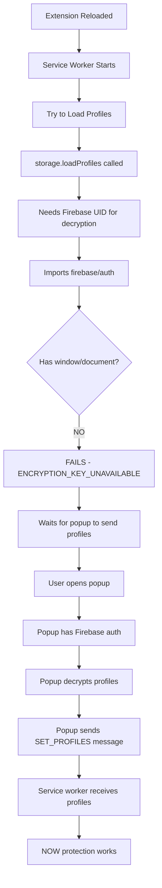
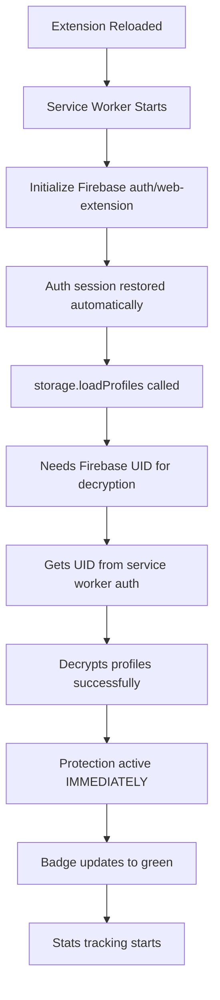

# Firebase Web Extension Migration Plan
**Date Created:** 2025-01-09
**Status:** 🟡 PLANNING
**Complexity:** ⚠️ CRITICAL - App-wide architectural change
**Estimated Time:** 2-3 days (careful implementation required)

---

## Executive Summary

**Problem:** Service worker cannot access Firebase auth, causing:
- ❌ Badge shows "protected" when profiles not loaded
- ❌ Stats don't track until popup opens
- ❌ User must open popup after every reload for protection to work
- ❌ Activity logs queue indefinitely if popup never opened

**Solution:** Migrate from `firebase/auth` to `firebase/auth/web-extension` in service worker context.

**Impact:** This touches 69 TypeScript files, 9 auth-dependent files, 12 encryption files, and all message passing logic.

---

## Current Architecture (BEFORE)

### File Structure
```
src/
├── lib/
│   ├── firebase.ts              ← Uses firebase/auth (DOM-dependent)
│   ├── storage.ts               ← Encryption/decryption logic
│   ├── store.ts                 ← Zustand state management
│   └── firebaseService.ts       ← Firestore operations
├── background/
│   └── serviceWorker.ts         ← Cannot access Firebase auth
├── popup/
│   ├── popup-v2.ts              ← Has Firebase auth access
│   └── components/
│       ├── authModal.ts         ← Sign-in UI
│       └── userProfile.ts       ← User profile display
├── content/
│   └── content.ts               ← Content script (limited access)
└── auth/
    └── auth.ts                  ← OAuth redirect handler
```

### Current Flow (Extension Reload)



### Current Message Flow

**Messages FROM popup TO service worker:**
```typescript
// src/popup/popup-v2.ts:264-268
chrome.runtime.sendMessage({
  type: 'SET_PROFILES',
  payload: finalState.profiles  // Decrypted profiles
});

// src/popup/popup-v2.ts:272-274
chrome.runtime.sendMessage({
  type: 'FLUSH_ACTIVITY_LOGS'
});
```

**Messages FROM service worker TO popup:**
```typescript
// src/background/serviceWorker.ts:1134-1137
chrome.runtime.sendMessage({
  type: 'ADD_ACTIVITY_LOG',
  payload: entry  // Activity log to encrypt
});
```

**Messages FROM content script:**
```typescript
// src/content/content.ts:67
chrome.runtime.sendMessage({ type: 'GET_PROFILES' });

// src/content/content.ts:49
chrome.runtime.sendMessage({ type: 'GET_CONFIG' });
```

---

## Target Architecture (AFTER)

### New File Structure
```
src/
├── lib/
│   ├── firebase.ts              ← Context-aware: web-extension OR auth
│   ├── firebase-web-ext.ts      ← NEW: Service worker-specific auth
│   ├── storage.ts               ← Works in ALL contexts
│   └── store.ts                 ← Zustand (no changes needed)
├── background/
│   └── serviceWorker.ts         ← HAS Firebase auth access
├── popup/
│   ├── popup-v2.ts              ← No longer sends profiles
│   └── components/
│       ├── authModal.ts         ← Sign-in still here
│       └── userProfile.ts       ← No changes
├── content/
│   └── content.ts               ← No changes
└── auth/
    └── auth.ts                  ← No changes
```

### Target Flow (Extension Reload)



### Target Message Flow

**Messages REMOVED:**
- ❌ `SET_PROFILES` - No longer needed
- ❌ `FLUSH_ACTIVITY_LOGS` - Activity encrypts immediately
- ❌ `ADD_ACTIVITY_LOG` - Service worker encrypts directly

**Messages KEPT:**
- ✅ `GET_PROFILES` - Content script still queries service worker
- ✅ `GET_CONFIG` - Config loading unchanged

---

## Files Requiring Changes

### Priority 1: Core Firebase Auth (CRITICAL)

#### 1.1 `src/lib/firebase.ts`
**Current State:**
```typescript
import { getAuth } from 'firebase/auth';
auth = getAuth(app);  // Fails in service worker
```

**Required Changes:**
```typescript
// Detect execution context
const isServiceWorker = typeof document === 'undefined';

if (isServiceWorker) {
  // Service worker context - use web-extension module
  const { getAuth } = await import('firebase/auth/web-extension');
  auth = getAuth(app);
  console.log('[Firebase] Using web-extension auth in service worker');
} else {
  // Popup/content context - use standard module
  const { getAuth } = await import('firebase/auth');
  auth = getAuth(app);
  console.log('[Firebase] Using standard auth in popup/content');
}
```

**Complexity:** 🔴 HIGH
**Risk:** Auth session handling across contexts
**Test:** Verify auth.currentUser works in both popup AND service worker

---

#### 1.2 `src/lib/storage.ts`
**Current State:**
```typescript
// Line 1787 - Throws error in service worker
throw new Error('ENCRYPTION_KEY_UNAVAILABLE: Firebase auth not available...');

// Line 127-128 - Skips profile loading in service worker
console.log('[StorageManager] Service worker context - skipping profile initialization');
console.log('[StorageManager] Profiles will be sent from popup via SET_PROFILES message');
```

**Required Changes:**
```typescript
// REMOVE Lines 127-128 - Service worker CAN load profiles now
// REMOVE error throw at line 1787 - Auth IS available

// Keep the context detection but allow loading:
if (isServiceWorker) {
  console.log('[StorageManager] Service worker context - loading profiles with web-extension auth');
}

// Load profiles normally in ALL contexts
const profiles = await this.loadProfiles();
```

**Complexity:** 🟡 MEDIUM
**Risk:** Decryption failures if auth not ready
**Test:** Verify profiles decrypt in service worker after extension reload

---

### Priority 2: Service Worker Changes

#### 2.1 `src/background/serviceWorker.ts`
**Current State:**
```typescript
// Line 763 - Catches decryption error and waits for profiles
try {
  const profiles = await storage.loadProfiles();
} catch (error) {
  // Expects error, waits for SET_PROFILES message
}

// Line 836-839 - Receives profiles from popup
case 'SET_PROFILES':
  return handleSetProfiles(message.payload);
```

**Required Changes:**
```typescript
// REMOVE error catching - profiles should load successfully
const profiles = await storage.loadProfiles();
console.log('[Background] ✅ Loaded', profiles.length, 'profiles with web-extension auth');

// REMOVE SET_PROFILES handler - no longer needed
// DELETE case 'SET_PROFILES': ...

// REMOVE FLUSH_ACTIVITY_LOGS - no longer needed
// DELETE case 'FLUSH_ACTIVITY_LOGS': ...
```

**Files to Update:**
- Line 337-340: Remove `FLUSH_ACTIVITY_LOGS` case
- Line 334-335: Remove `SET_PROFILES` case
- Line 762-776: Remove try/catch for profile loading
- Line 836-846: Remove `handleSetProfiles` function
- Line 1156-1186: Remove `flushActivityLogQueue` function
- Line 1091-1105: Remove `activityLogQueue` variable

**Complexity:** 🟢 LOW
**Risk:** Low - mostly deletions
**Test:** Verify service worker loads profiles without popup

---

#### 2.2 Activity Logging in Service Worker
**Current State:**
```typescript
// Line 1126-1150 - Queues activity, tries to send to popup
async function logActivity(entry) {
  activityLogQueue.push(entry);
  try {
    await chrome.runtime.sendMessage({ type: 'ADD_ACTIVITY_LOG', payload: entry });
  } catch {
    console.log('Popup not available - activity queued');
  }
}
```

**Required Changes:**
```typescript
async function logActivity(entry) {
  // Service worker can encrypt now - save directly
  const storage = StorageManager.getInstance();
  await storage.addActivityLog(entry);
  console.log('[Background] ✅ Activity log encrypted and saved');
}
```

**Complexity:** 🟢 LOW
**Risk:** None - simplification
**Test:** Verify stats track immediately after substitution

---

### Priority 3: Popup Changes

#### 3.1 `src/popup/popup-v2.ts`
**Current State:**
```typescript
// Line 264-268 - Sends profiles to background
chrome.runtime.sendMessage({
  type: 'SET_PROFILES',
  payload: finalState.profiles
});

// Line 272-280 - Requests queued logs
chrome.runtime.sendMessage({
  type: 'FLUSH_ACTIVITY_LOGS'
});

// Line 369-395 - Receives activity logs from background
chrome.runtime.onMessage.addListener((message) => {
  if (message.type === 'ADD_ACTIVITY_LOG') {
    // Encrypt and save
  }
});
```

**Required Changes:**
```typescript
// DELETE Lines 264-268 - No longer send profiles to background
// Profiles already loaded in service worker

// DELETE Lines 272-280 - No queue to flush

// DELETE Lines 369-395 - No activity logs to receive
// Service worker encrypts them directly
```

**Complexity:** 🟢 LOW
**Risk:** None - deletions only
**Test:** Popup still works, stats display correctly

---

#### 3.2 `src/popup/components/authModal.ts`
**Current State:**
```typescript
// Line 200-230 - After auth success, updates config
async function onAuthSuccess(user: User) {
  // Detect provider, update account
  await store.updateAccount({ ... });
}
```

**Required Changes:**
```typescript
async function onAuthSuccess(user: User) {
  // Same as before - still runs in popup context
  await store.updateAccount({ ... });

  // NEW: Notify service worker that auth changed
  chrome.runtime.sendMessage({
    type: 'AUTH_STATE_CHANGED',
    payload: { uid: user.uid }
  });
}
```

**Complexity:** 🟡 MEDIUM
**Risk:** Auth sync between contexts
**Test:** Sign in → service worker sees auth state → loads profiles

---

### Priority 4: Message Type Cleanup

#### 4.1 `src/lib/types.ts`
**Current State:**
```typescript
export type MessageType =
  | 'SET_PROFILES'           // Line 335
  | 'FLUSH_ACTIVITY_LOGS'    // Line 361
  | 'ADD_ACTIVITY_LOG'       // Line 360
  | ...
```

**Required Changes:**
```typescript
// DELETE Line 335: 'SET_PROFILES'
// DELETE Line 361: 'FLUSH_ACTIVITY_LOGS'
// DELETE Line 360: 'ADD_ACTIVITY_LOG'

// ADD new message type:
| 'AUTH_STATE_CHANGED'  // Notify service worker of auth changes
```

**Complexity:** 🟢 LOW
**Risk:** Type errors if not thorough
**Test:** TypeScript compilation succeeds

---

### Priority 5: Badge Logic Fix

#### 5.1 `src/background/serviceWorker.ts`
**Current State:**
```typescript
// Line 65 - Shows green badge if domain protected
serviceWorker.ts:65 [Badge] Tab 1284796304: PROTECTED (Green)

// Missing check: Are profiles loaded?
```

**Required Changes:**
```typescript
async function checkAndUpdateBadge(tabId: number, url?: string) {
  // Existing checks...
  const isProtectedDomain = ...;

  // NEW: Check if profiles are loaded
  const storage = StorageManager.getInstance();
  const profiles = await storage.loadProfiles();
  const hasActiveProfiles = profiles.filter(p => p.enabled).length > 0;

  if (!hasActiveProfiles) {
    // No active profiles - show warning
    chrome.action.setBadgeText({ tabId, text: '!' });
    chrome.action.setBadgeBackgroundColor({ tabId, color: '#EF4444' });
    console.log(`[Badge] Tab ${tabId}: NO PROFILES (Red)`);
    return;
  }

  // Rest of logic...
}
```

**Complexity:** 🟢 LOW
**Risk:** None
**Test:** Badge shows red when no profiles, green when loaded

---

## Testing Strategy

### Phase 1: Unit Tests
- [ ] Test Firebase auth initialization in service worker
- [ ] Test profile decryption in service worker
- [ ] Test activity log encryption in service worker
- [ ] Verify auth state sync between contexts

### Phase 2: Integration Tests
- [ ] Extension reload → service worker loads profiles
- [ ] Sign in → auth syncs to service worker
- [ ] Sign out → service worker clears profiles
- [ ] Multi-tab scenarios → consistent state

### Phase 3: Manual Testing
- [ ] Install extension fresh
- [ ] Reload extension
- [ ] Visit ChatGPT without opening popup
- [ ] Verify badge shows correct status
- [ ] Verify toast appears only when protected
- [ ] Send message → verify substitution works
- [ ] Check stats → verify immediate tracking
- [ ] Sign out → verify protection stops

### Phase 4: Edge Cases
- [ ] User not signed in → graceful degradation
- [ ] Auth session expires → re-authentication
- [ ] Multiple profiles → all decrypt correctly
- [ ] Service worker restart → profiles persist

---

## Migration Checklist

### Pre-Migration
- [x] Create this migration document
- [ ] Review with team
- [ ] Create backup branch
- [ ] Document rollback plan

### Phase 1: Core Auth (Day 1)
- [ ] Update `src/lib/firebase.ts` with context detection
- [ ] Test auth works in popup (regression test)
- [ ] Test auth works in service worker (new functionality)
- [ ] Verify `auth.currentUser` available in both contexts
- [ ] Run integration tests

### Phase 2: Storage & Encryption (Day 1-2)
- [ ] Remove service worker skip logic in `storage.ts`
- [ ] Remove `ENCRYPTION_KEY_UNAVAILABLE` error throw
- [ ] Test profile loading in service worker
- [ ] Test profile decryption in service worker
- [ ] Verify encrypted data integrity

### Phase 3: Service Worker Cleanup (Day 2)
- [ ] Remove `SET_PROFILES` message handler
- [ ] Remove `FLUSH_ACTIVITY_LOGS` handler
- [ ] Remove `ADD_ACTIVITY_LOG` sender
- [ ] Remove `activityLogQueue` and flush logic
- [ ] Update `logActivity()` to encrypt directly
- [ ] Test activity logging works without popup

### Phase 4: Popup Cleanup (Day 2)
- [ ] Remove profile sending logic
- [ ] Remove activity log receiver
- [ ] Remove flush request
- [ ] Test popup still works independently
- [ ] Verify stats display correctly

### Phase 5: Message Types (Day 2)
- [ ] Remove unused message types from `types.ts`
- [ ] Add `AUTH_STATE_CHANGED` type
- [ ] Fix all TypeScript compilation errors
- [ ] Run full test suite

### Phase 6: Badge & UX (Day 2-3)
- [ ] Update badge logic to check profiles
- [ ] Test badge colors (green/red/none)
- [ ] Verify toast only shows when protected
- [ ] Test all protection indicators

### Phase 7: Integration Testing (Day 3)
- [ ] Fresh install test
- [ ] Extension reload test
- [ ] Auth flow test (sign in/out)
- [ ] Multi-tab test
- [ ] Stats tracking test
- [ ] All 5 platforms test

### Post-Migration
- [ ] Update documentation
- [ ] Update README if needed
- [ ] Create release notes
- [ ] Monitor for issues

---

## Rollback Plan

If migration fails:

1. **Immediate Rollback:**
   ```bash
   git checkout launch_06
   git branch -D firebase-web-ext-migration
   ```

2. **Restore Points:**
   - Before Phase 1: Commit hash `[TO BE FILLED]`
   - After Phase 1: Commit hash `[TO BE FILLED]`
   - After Phase 2: Commit hash `[TO BE FILLED]`

3. **Verification:**
   - All tests passing
   - No console errors
   - Badge shows correct state
   - Stats tracking works

---

## Risk Assessment

### High Risk Areas
🔴 **Firebase auth initialization**
- Could break auth completely
- Mitigation: Test in both contexts before proceeding

🔴 **Profile decryption in service worker**
- Could lose access to encrypted data
- Mitigation: Never delete encrypted data, only change how we decrypt

🟡 **Auth session persistence**
- Auth might not sync between popup and service worker
- Mitigation: Use `AUTH_STATE_CHANGED` message to sync

### Low Risk Areas
🟢 **Message type cleanup**
- Just TypeScript type changes
- Easy to fix if issues arise

🟢 **Activity log encryption**
- Simplification, not complication
- Falls back gracefully

---

## Success Criteria

✅ Extension reload → protection active immediately
✅ Badge shows accurate status (red/green)
✅ Toast only shows when actually protected
✅ Stats track without opening popup
✅ No profile-sending messages needed
✅ Service worker fully self-sufficient
✅ All 750 tests passing
✅ Zero console errors

---

## Open Questions

1. **Auth Session Sharing:**
   - Does `firebase/auth/web-extension` share session with `firebase/auth`?
   - Or do we need separate sign-in for service worker?
   - **Answer:** Need to test - may need `AUTH_STATE_CHANGED` sync

2. **Auth Persistence:**
   - How long does service worker auth persist?
   - Does it survive service worker restart?
   - **Answer:** Firebase handles persistence via IndexedDB

3. **Performance Impact:**
   - Is there overhead from having auth in service worker?
   - Does it slow down request interception?
   - **Answer:** Should be minimal - test with performance profiling

4. **Backward Compatibility:**
   - What happens to users who update from current version?
   - Do they need to sign in again?
   - **Answer:** Likely yes - document in release notes

---

## Notes

- Take breaks between phases
- Test thoroughly after each phase
- Don't rush - this is foundational
- Document any unexpected behaviors
- Ask questions before proceeding if uncertain

---

**Next Step:** Review this document, then proceed with Phase 1 when ready.
